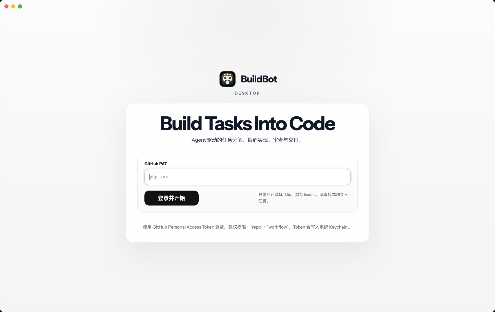

# BuildBot Desktop

> A local console for agentic software delivery.  

BuildBot Desktop 不是一个聊天式 AI 壳层，也不只是把 GitHub Issue 交给模型“跑一下”的自动化工具。它更接近一套面向真实代码仓库的本地 Agent orchestration console，用来把任务入口、上下文装配、代码实现、审查门禁与交付动作收敛成可控闭环。

在 BuildBot Desktop 里，Issue 或本地录入任务只是起点。真正的核心，是让不同职责的 Agent 在同一条工程链路里协同工作：Implementation Agent 负责推进改动，Review Agent 负责质量门禁，调度层负责队列、工作区、日志、风险控制与最终提交。

这个项目想解决的，不是“如何让模型写一段代码”，而是“如何让 Agent 系统以工程化方式持续地产出可审查、可追踪、可交付的结果”。




## 为什么做这个项目

很多 AI 开发工具已经能完成“生成代码”这一步，但在真实团队环境里，真正决定可用性的往往是 Agent 之间如何协同、质量如何收口、风险如何约束，以及结果是否能顺利进入交付链路。

常见问题通常也集中在这里：

- 只能调用单一模型，难以区分“执行”和“审查”角色
- 缺少任务队列与可视化日志，不适合连续处理多个 Issue
- 能改代码，但缺少稳定的 Review 回路，结果难直接合入
- 自动拉取 Issue 后容易失控，缺少人工确认和风险拦截

BuildBot Desktop 的思路，是把这些关键能力落到一个本地、可观察、可调度、可干预的 Agent 系统里，让仓库维护者真正拥有对执行链路、审查门槛和自动化边界的控制权。

## 核心特性

- GitHub 登录与仓库 / Issue 浏览，支持筛选、查看详情和评论
- 一键把 Issue 发起为 `bugfix` 或 `feature` 任务
- 串行任务队列，适合持续处理多个待办项
- Implementation Agent 与 Review Agent 分离，且可分别选择 Claude 或 Codex
- Review 严格度可配置，支持多轮审查与返工
- Review 通过后自动提交结果，支持创建 PR 或直推目标分支
- 自动模式可定时轮询 Open Issues，并按标签白名单自动入队
- 实时日志面板，便于追踪执行过程、失败点和审查反馈
- 风险 Issue 检测，命中高风险规则时自动转人工确认
- GitHub Token 存入系统 Keychain，而不是明文落盘

## 工作流

1. 使用 GitHub PAT 登录并拉取可访问仓库。
2. 选择仓库和目标 Issue，发起 `AI 修复` 或 `AI 开发`。
3. BuildBot 准备工作区。
   `PR 模式`：自动执行 Fork -> 分支 -> Clone。  
   `直提模式`：直接切到配置的目标分支。
4. Implementation Agent 在本地工作区修改代码，并输出过程日志。
5. Review Agent 以只读方式审查当前改动，判断 `PASS` 或 `FAIL`。
6. 如果审查失败，系统按反馈继续返工，直到通过或达到最大轮次。
7. 审查通过后，自动提交结果。
   `PR 模式`：push 并创建 Pull Request。  
   `直提模式`：push 到指定分支。

## 前置条件

在本地运行前，需要准备：

- 一个可用的 Node.js / npm 环境
- 本机已安装 `git`
- 一个 GitHub Personal Access Token
  建议至少具备 `repo`、`workflow` 权限
- 至少安装并登录一个 Agent CLI
  `claude`：执行 `claude auth login`
  `codex`：执行 `codex login`

如果你希望把 Claude 用作执行或审查器，还需要本机安装 Claude Code。  
如果你希望把 Codex 用作执行或审查器，还需要本机安装 Codex CLI。

## 快速启动

```bash
npm install
npm run dev
```

常用检查命令：

```bash
npm test
npm run typecheck
```

## 使用方式

1. 启动应用后输入 GitHub PAT 登录。
2. 选择仓库，浏览或筛选 Issue。
3. 打开目标 Issue，点击 `AI 修复` 或 `AI 开发`。
4. 在右侧日志区域查看执行过程。
5. 在设置面板中调整：
   Implementation Provider
   Review Provider
   Review Strictness
   Review Max Rounds
   Submission Mode
   Direct Branch Name

## 自动模式

自动模式用于持续轮询当前仓库的 Open Issues，并自动把符合条件的任务放进队列。

- 轮询范围：当前选中仓库的 Open Issues
- 触发时机：登录后、切换仓库后，以及后续定时轮询
- 入队规则：只处理命中标签白名单的 Issue
- 默认白名单：`bug`, `enhancement`
- 自动去重：已有任务的 Issue 不会重复入队
- 风险拦截：带有人工确认标签或命中高风险规则的 Issue 会被跳过

这使它更适合处理一类“可以批量自动推进，但仍需要边界控制”的仓库维护任务。

## 安全与控制

BuildBot Desktop 不是无条件执行器，当前版本已经加入了一些基础保护：

- 检测疑似 prompt injection、凭据导出、破坏性命令、远程脚本执行等高风险内容
- 命中规则后自动添加 `needs-human-confirmation` 标签并暂停执行
- Review Agent 只做审查，不允许修改文件或直接提交
- GitHub Token 使用系统 Keychain 保存

这套机制仍然是 MVP 级别，但已经覆盖了最常见的自动化失控场景。

## 当前限制

- 仍以 PAT 登录为主，尚未接入完整 GitHub OAuth 流程
- Prompt 自定义、多账号切换、通知系统仍未实现
- Markdown 渲染已加入基础 DOM sanitizer，但仍建议继续强化白名单策略
- 依赖本机已有 `git` 与至少一个可用的 Agent CLI
- Electron 打包配置已存在，但仓库里还没有整理完整发布流程

## 技术栈

- Electron
- React
- TypeScript
- Vite
- Zustand
- Octokit
- simple-git
- keytar

## 项目结构

```text
src/
  main/
    agent/          # Agent 调度
    automation/     # 自动模式
    claude/         # Claude CLI 集成
    codex/          # Codex CLI 集成
    git/            # Git 工作区与提交流程
    github/         # GitHub API 与 Token 管理
    ipc/            # Electron IPC
    queue/          # 任务队列与执行主流程
    security/       # Issue 风险检测
    settings/       # 本地配置
    task-history/   # 任务持久化
  renderer/
    components/
    store/
  shared/
tests/
assets/
```

## 适合谁用

- 想把 GitHub Issue 处理流程自动化的个人开发者
- 需要一个本地可控的 AI coding 工作台，而不是纯云端代理
- 希望把“实现”和“审查”拆给不同 Agent 的仓库维护者
- 想先用 MVP 验证自动化研发流程，再决定是否扩展到更完整的平台
